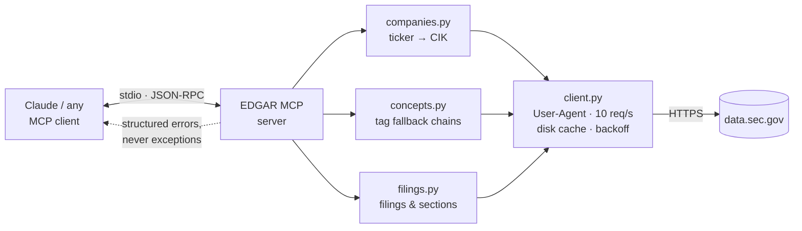

# EDGAR MCP — SEC financial filing data as agent tools

Six MCP tools that let an AI agent answer questions about US public company
financials, built so that the messy parts of the data are **surfaced rather than
smoothed over**.

<!-- DEMO GOES HERE. Record it before you publish this repo — a 3-minute video
     above the fold does more than the whole README below it.
     Script: demo/SCRIPT.md -->

> ### ⚠️ Evaluation not yet run
> The server and the eval harness are complete and tested (152 unit tests, no
> network needed). The **eval itself has not been run**, so every number below
> reads `NOT YET RUN`. There are no placeholder figures anywhere in this
> repository. Run `python evals/run_eval.py` to fill them in.

---

## The problem

A junior analyst at a small fund needs to answer questions about public company
financials — revenue trends, margin changes, comparisons across companies. Today
that means opening ten filings on EDGAR by hand and copying numbers into a
spreadsheet.

The obvious fix is to give an AI agent access to the SEC's API. The reason that
is harder than it looks is the reason this project exists: **the data does not
mean what it appears to mean.**

Three specific ways it lies:

1. **The same concept has different names.** There is no XBRL tag called
   "revenue". Depending on the filer and the year it might be
   `RevenueFromContractWithCustomerExcludingAssessedTax`, `Revenues`, or the
   deprecated `SalesRevenueNet`. There is no authoritative mapping.
2. **Numbers change after they are published.** Companies restate. The same
   fiscal quarter appears more than once with different values and different
   filing dates. Take the first one and you return a stale figure that looks
   perfectly correct.
3. **"FY2024" is not one time period.** NVIDIA's fiscal 2024 ended in January
   2024. Apple's fiscal 2023 ended in September 2023. Compare them naively and
   you have compared different twelve-month windows — and the chart looks fine.

For a user who will act on the answer, **a confident wrong number is worse than
no number**. That constraint drove every design decision here.

---

## What I built



| Tool | What it does | The messiness it handles |
|---|---|---|
| `resolve_company` | ticker or name → CIK | **Refuses to guess** when the top two fuzzy matches are within 0.05 — returns candidates and asks for disambiguation |
| `list_filings` | filing history, filterable | 10-K vs 10-K/A vs 10-KT; marks amendments as superseding |
| `get_financial_concept` | time series for one concept | Tag fallback chain; restatement detection; unit isolation |
| `compare_companies` | one concept across N companies | **Detects fiscal-year misalignment** and warns when periods differ by >45 days |
| `get_filing_section` | named section from a filing | Inconsistent HTML across filers and decades |
| `search_full_text` | EDGAR full-text search | Tool description states the 2001-onward coverage limit |

Six tools, deliberately. Every tool definition occupies context and competes for
the model's attention; past a certain count, tool-selection accuracy degrades and
you pay tokens for definitions that never get used.

---

## Results

> `NOT YET RUN` — `python evals/run_eval.py --provider groq`

25 hand-written questions, each run **3 times** (a single run on a stochastic
system is not a measurement).

| Metric | Result |
|---|---|
| Accuracy (within tolerance) | — |
| Refusal correctness (4 unanswerable questions) | — |
| Citation rate (names form + fiscal period) | — |
| Mean tool calls per question | — |
| Variance across the 3 runs | — |
| p50 / p95 latency | — |
| Cost per question | — |

The question set is deliberately uncomfortable: 8 straightforward lookups,
6 comparisons requiring fiscal-year normalization, 5 genuinely ambiguous,
**4 that the system should refuse**, and 2 involving restated figures.

Measuring *refusal correctness* matters as much as accuracy. A system that
answers everything is more dangerous than one that answers less, because the
analyst cannot tell which answers to trust.

**When you run this, report the failures.** An eval result of 82% with an
analysis of the five failures is worth more than a claim of 100%.

---

## The hard parts

### 1. Concept-tag resolution

There is no tag called "revenue". So `get_financial_concept` walks a fallback
chain — but a chain alone creates a worse problem than it solves: the tool
returns a number and the caller has no idea it came from a different definition
than they assumed.

```python
CONCEPT_CHAINS = {
    "revenue": _chain(
        "revenue",
        "Total revenue",
        [
            "RevenueFromContractWithCustomerExcludingAssessedTax",  # ASC 606, most post-2018 filers
            "RevenueFromContractWithCustomerIncludingAssessedTax",
            "Revenues",                                             # generic
            "SalesRevenueNet",                                      # deprecated, pre-2018
            "SalesRevenueGoodsNet",                                 # goods only — NOT comparable
        ],
        ...
    ),
}
```

**The design decision:** every response states `matched_tag` and `tags_tried`.
Always. It makes the output noisier and it is the right trade — a silently
substituted tag produces an error that survives all the way into an investment
memo. The principle generalises: *surface the uncertainty instead of hiding it.*

### 2. Restatements

The SEC returns every version of a fact ever filed. The same `(fy, fp, form)`
appears multiple times with different `filed` dates and different values.

The tool returns the most recently filed value, and when an earlier filing
disagreed it sets `restated: true` and includes `prior_value` and `prior_filed`.

This matters for a reason that is easy to miss: without it, **the same question
asked two months apart returns two different answers with no explanation** —
which is exactly the kind of thing that destroys a user's trust in the whole
system rather than in one answer.

### 3. Knowing when to refuse

`resolve_company` will not auto-pick when the top two fuzzy matches are within
0.05 of each other. It returns both and asks.

This is arguably worse UX. It is better engineering. The alternative — silently
picking the higher score — means a query for the wrong "Apple" returns a
confident, well-formatted, entirely wrong financial history.

Every tool returns errors as data, never as exceptions:

```python
{
    "error": "Ambiguous company name: 2 candidates within 0.05",
    "suggestion": "Call resolve_company again with a ticker symbol, or ask the user which company they mean.",
}
```

The `suggestion` field is written **for the model to read**, not for a human.
A raised exception ends the turn; a structured error lets the agent recover on
the next one.

---

## What breaks in production

Full account in **[DEPLOYMENT.md](DEPLOYMENT.md)**, written for a non-technical
reader. The three that bite first:

- **SEC rate limits at ~10 requests/second.** A few concurrent users and you are
  queuing. The ceiling is architectural, not a tuning problem.
- **Restatement drift.** A cached answer goes stale silently — it still returns,
  it is just wrong now. Cache invalidation has to key on new filings, not on a
  timer.
- **Fiscal-year misalignment.** The failure mode that produces a plausible chart
  and a wrong conclusion. `compare_companies` warns; nothing forces the user to
  read the warning.

---

## Run it yourself

```bash
git clone https://github.com/Arnavdsp/edgar-mcp.git
cd edgar-mcp

pip install -e ".[dev]"
python -m pytest            # 152 tests, no network required

# The SEC requires a declared User-Agent with real contact details.
# Requests without one are rejected with 403.
cp .env.example .env        # set SEC_USER_AGENT="Your Name your@email.com"
```

Register with Claude Desktop — add to `claude_desktop_config.json`:

```json
{
  "mcpServers": {
    "edgar": {
      "command": "python",
      "args": ["-m", "edgar_mcp.server"],
      "env": { "SEC_USER_AGENT": "Your Name your@email.com" }
    }
  }
}
```

Run the evaluation:

```bash
python evals/run_eval.py --provider groq --runs 3 --max-cost 5.00
# writes evals/results/RESULTS.md
```

---

## What I would do differently

**The fallback chains are hardcoded.** I built them from tags I saw while
developing. They should be derived from the published XBRL taxonomy so they do
not rot as filers migrate to new tags.

**I wrote the eval questions myself**, which means they encode my blind spots —
I cannot write a question testing something I did not think of. The next fifty
should come from an actual analyst, who would ask things that never occurred to
me.

**Section extraction is fragile.** `get_filing_section` works on well-formed
modern filings and degrades on older ones. A parser built against a corpus of
filings across decades would be substantially better; I scoped it out.

---

## Licence

MIT. Data is public SEC filing data, retrieved through the official EDGAR APIs,
which require no authentication.
