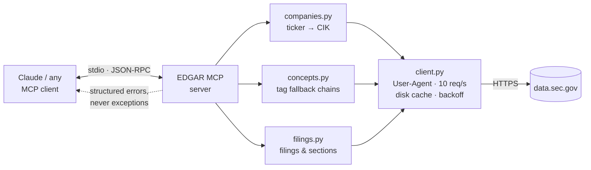

# EDGAR MCP — SEC financial filing data as agent tools

Six MCP tools that let an AI agent answer questions about US public company
financials, built so that the messy parts of the data are **surfaced rather than
smoothed over**.

<!-- DEMO GOES HERE. Record it before you publish this repo — a 3-minute video
     above the fold does more than the whole README below it.
     Script: demo/SCRIPT.md -->

> ### 📊 Evaluation & Deployment Status
> * **Model & Infrastructure:** Tested on `openai/gpt-oss-20b` via Groq free tier.
> * **Evaluation Scale:** 25 hand-verified financial questions evaluated across **3 full runs** (75 total attempts) using 6 EDGAR MCP tools over stdio.
> * **Headline Results:** **90.7% refusal correctness** (safely refusing out-of-scope or unanswerable queries) and **12.5% numeric accuracy** on standard financial lookups. See [Results](#results) below for the complete per-category and failure breakdown.
> * **Production Deployment:** Read [`DEPLOYMENT.md`](DEPLOYMENT.md) for production guidelines, SEC rate limits (10 req/s), concept fallback tag resolution, and interpretation guardrails.

---

## The problem

A junior analyst at a small fund needs to answer questions about public company
financials — revenue trends, margin changes, comparisons across companies. Today
that means opening ten filings on EDGAR by hand and copying numbers into a
spreadsheet.

The obvious fix is to give an AI agent access to the SEC's API. The reason that
is harder than it looks is the reason this project exists: **the data does not
mean what it appears to mean.**

Three specific ways it lies:

1. **The same concept has different names.** There is no XBRL tag called
   "revenue". Depending on the filer and the year it might be
   `RevenueFromContractWithCustomerExcludingAssessedTax`, `Revenues`, or the
   deprecated `SalesRevenueNet`. There is no authoritative mapping.
2. **Numbers change after they are published.** Companies restate. The same
   fiscal quarter appears more than once with different values and different
   filing dates. Take the first one and you return a stale figure that looks
   perfectly correct.
3. **"FY2024" is not one time period.** NVIDIA's fiscal 2024 ended in January
   2024. Apple's fiscal 2023 ended in September 2023. Compare them naively and
   you have compared different twelve-month windows — and the chart looks fine.

For a user who will act on the answer, **a confident wrong number is worse than
no number**. That constraint drove every design decision here.

---

## What I built



| Tool | What it does | The messiness it handles |
|---|---|---|
| `resolve_company` | ticker or name → CIK | **Refuses to guess** when the top two fuzzy matches are within 0.05 — returns candidates and asks for disambiguation |
| `list_filings` | filing history, filterable | 10-K vs 10-K/A vs 10-KT; marks amendments as superseding |
| `get_financial_concept` | time series for one concept | Tag fallback chain; restatement detection; unit isolation |
| `compare_companies` | one concept across N companies | **Detects fiscal-year misalignment** and warns when periods differ by >45 days |
| `get_filing_section` | named section from a filing | Inconsistent HTML across filers and decades |
| `search_full_text` | EDGAR full-text search | Tool description states the 2001-onward coverage limit |

Six tools, deliberately. Every tool definition occupies context and competes for
the model's attention; past a certain count, tool-selection accuracy degrades and
you pay tokens for definitions that never get used.

---

## Results

<!-- RESULTS:START — generated by publish-results.py, do not edit by hand -->
## Eval results

Generated by `evals/run_eval.py` on 2026-09-11T15:34:06+00:00.
Every number below was measured by that run. Nothing here is typed by hand.

### Run configuration

| Setting | Value |
|---|---|
| Provider | `openai` |
| Model | `openai/gpt-oss-20b` |
| Questions | 25 |
| Runs per question | 3 |
| Total attempts | 75 |
| Server cache | enabled |
| Max turns per question | 8 |

### Headline metrics

Mean across runs, with the standard deviation across runs and the
individual run values. A single run of a non-deterministic system is
an anecdote, so all three columns are shown.

| Metric | Mean | Std dev | Per run |
|---|---|---|---|
| Accuracy (numeric answers within tolerance) | 12.5% | ±12.5 | 25.0, 12.5, 0.0 |
| Refusal correctness | 90.7% | ±2.3 | 88.0, 92.0, 92.0 |
| Citation rate (names form and period) | 0.0% | ±0.0 | 0.0, 0.0, 0.0 |
| Required-phrase coverage | 29.3% | ±2.3 | 28.0, 32.0, 28.0 |
| Tool calls per question | 0.17 | ±0.17 | 0.36, 0.12, 0.04 |
| Latency p50 (s) | 2083.0 | ±560.3 | 1445.7, 2498.1, 2305.3 |
| Latency p95 (s) | 4268.4 | ±704.3 | 3455.6, 4699.2, 4650.5 |
| Cost per run (USD) | 0.0000 | ±0.0000 | 0.0000, 0.0000, 0.0000 |
| Errored attempts | 18 | ±1 | 17, 18, 19 |

### Pass rate by category

| Category | Questions | Pass rate |
|---|---|---|
| ambiguous | 5 | 33% |
| comparison | 6 | 0% |
| lookup | 8 | 12% |
| refusal | 4 | 42% |
| restatement | 2 | 0% |

### Per question

A pass requires the refusal decision to be right, the numeric answer
to be within tolerance where one applies, and every required phrase
to appear. Rows marked for review are scored by keyword and need a
human to confirm.

| ID | Category | Pass rate | Tool calls | Latency (s) | Review |
|---|---|---|---|---|---|
| `rev_nvda_fy24` | lookup | 0% | 1.0 | 2275.4 |  |
| `assets_amzn_fy24` | lookup | 0% | 0.0 | 2742.0 |  |
| `cash_tsla_fy24` | lookup | 0% | 0.0 | 2112.5 |  |
| `opinc_aapl_fy24` | lookup | 0% | 0.0 | 2061.3 |  |
| `liab_msft_fy24` | lookup | 0% | 0.0 | 2399.0 |  |
| `cmp_nvda_aapl_rev_fy24` | comparison | 0% | 0.0 | 3226.5 |  |
| `cmp_msft_aapl_ni_fy24` | comparison | 0% | 0.0 | 3048.3 |  |
| `cmp_tsla_nvda_rnd_fy24` | comparison | 0% | 0.0 | 2014.5 |  |
| `cmp_amzn_msft_assets_fy24` | comparison | 0% | 0.0 | 2363.6 |  |
| `cmp_five_rev_fy24` | comparison | 0% | 0.0 | 3908.3 |  |
| `cmp_nvda_tsla_growth` | comparison | 0% | 0.0 | 3009.4 |  |
| `amb_apple_name` | ambiguous | 0% | 0.0 | 2253.8 | yes |
| `amb_nvda_profitable` | ambiguous | 0% | 0.7 | 3894.4 | yes |
| `amb_msft_debt` | ambiguous | 0% | 0.0 | 3581.6 | yes |
| `ref_future_2027` | refusal | 0% | 0.0 | 1054.3 |  |
| `ref_stock_price` | refusal | 0% | 0.0 | 1084.1 |  |
| `rst_tsla_revision` | restatement | 0% | 0.0 | 3200.6 | yes |
| `rst_amzn_fy22` | restatement | 0% | 0.0 | 2931.6 | yes |
| `rev_aapl_fy24` | lookup | 33% | 0.7 | 1162.8 |  |
| `ni_msft_fy24` | lookup | 33% | 0.7 | 1544.3 |  |
| `rnd_nvda_fy24` | lookup | 33% | 0.7 | 2457.0 |  |
| `amb_aapl_margins` | ambiguous | 67% | 0.0 | 828.8 | yes |
| `ref_fts_1998` | refusal | 67% | 0.7 | 1915.4 |  |
| `amb_delta_name` | ambiguous | 100% | 0.0 | 488.4 | yes |
| `ref_stripe_private` | refusal | 100% | 0.0 | 561.2 |  |

### Failures

23 of 25 questions failed at least one run. Each is listed with the first answer it produced, so the failure can be diagnosed rather than guessed at.

#### `rev_nvda_fy24` — 0% pass rate

**Question.** What was NVIDIA's total revenue in fiscal year 2024?

**What it tests.** The one verified value in this file. Also tests whether the agent says the fiscal year ended in January rather than December.

**First answer.**

```
I’m sorry, but the EDGAR tools do not have a revenue figure for NVIDIA’s fiscal year 2024. The most recent annual revenue data available is for FY 2022 (reported in the 10‑K filed 2022‑03‑18, ending 2022‑01‑30).
```

#### `assets_amzn_fy24` — 0% pass rate

**Question.** What were Amazon's total assets at the end of its 2024 fiscal year?

**What it tests.** A balance-sheet concept: instant rather than duration. Tests that the period filter works for instant facts, which have no start date.

**First answer.**

```

```

#### `cash_tsla_fy24` — 0% pass rate

**Question.** How much cash and cash equivalents did Tesla have at the end of 2024?

**What it tests.** Cash excludes short-term investments. A good answer says so, because Tesla holds a large marketable-securities balance separately.

**First answer.**

```

```

#### `opinc_aapl_fy24` — 0% pass rate

**Question.** What was Apple's operating income in fiscal 2024?

**What it tests.** operating_income has no fallback tag by design. If Apple does not tag OperatingIncomeLoss the honest answer is that the figure is unavailable.

**First answer.**

```

```

#### `liab_msft_fy24` — 0% pass rate

**Question.** What were Microsoft's total liabilities at the end of fiscal 2024?

**What it tests.** total_liabilities has a single-tag chain. Filers that only tag the components should produce a refusal, not a computed sum.

**First answer.**

```

```

#### `cmp_nvda_aapl_rev_fy24` — 0% pass rate

**Question.** Compare NVIDIA's and Apple's revenue for fiscal year 2024.

**What it tests.** The headline case. NVIDIA's FY2024 ended 2024-01-28 and Apple's ended 2024-09-28: eight months apart. The answer must say the periods do not line up. Scoring this on the numbers alone would miss the whole point.

**First answer.**

```

```

#### `cmp_msft_aapl_ni_fy24` — 0% pass rate

**Question.** Who made more money in fiscal 2024, Microsoft or Apple?

**What it tests.** Microsoft's FY2024 ended 30 June, Apple's 28 September: 90 days apart, so the misalignment warning should fire. "Made more money" is also loose; a good answer says which measure it used.

**First answer.**

```

```

#### `cmp_tsla_nvda_rnd_fy24` — 0% pass rate

**Question.** Compare R&D spending at Tesla and NVIDIA for their 2024 fiscal years.

**What it tests.** Tesla's fiscal year ends 31 December, NVIDIA's in late January. Roughly 11 months apart in nominal FY2024 terms.

**First answer.**

```

```

#### `cmp_amzn_msft_assets_fy24` — 0% pass rate

**Question.** How do Amazon's and Microsoft's total assets compare for fiscal 2024?

**What it tests.** Balance-sheet dates six months apart. Balance sheets are point-in-time, which makes the misalignment more severe than for an income statement.

**First answer.**

```

```

#### `cmp_five_rev_fy24` — 0% pass rate

**Question.** Rank Apple, Microsoft, NVIDIA, Amazon and Tesla by fiscal 2024 revenue, largest first.

**What it tests.** Five companies, four distinct fiscal year ends. Tests that the ranking is still produced but is qualified. Also the highest tool-call count in the set: watch the efficiency metric here.

**First answer.**

```

```

#### `cmp_nvda_tsla_growth` — 0% pass rate

**Question.** Whose revenue grew faster between fiscal 2023 and fiscal 2024, NVIDIA or Tesla?

**What it tests.** Requires four figures and a computation the tools do not perform. The agent must say it calculated the growth rates itself.

**First answer.**

```

```

#### `amb_apple_name` — 0% pass rate

**Question.** What was Apple's revenue last year?

**What it tests.** Two ambiguities at once. "Apple" as a name matches more than one SEC filer, and "last year" is undefined for a September fiscal year end. Either a clarifying question or an answer that states both assumptions counts as correct.

**First answer.**

```

```

#### `amb_nvda_profitable` — 0% pass rate

**Question.** How profitable was NVIDIA last year?

**What it tests.** Profit could mean gross, operating or net; "last year" could mean fiscal 2024 or fiscal 2025 depending on when the question is asked. A good answer states which it used and why.

**First answer.**

```
NVIDIA reported net income of **$4.37 billion** for its fiscal year that ended **January 29, 2023**.  
The figure comes from the company’s DEF 14A filing (accession 0001045810‑26‑000036) filed on May 12, 2026, which reports the FY 2023 period.
```

#### `amb_msft_debt` — 0% pass rate

**Question.** How much debt does Microsoft have?

**What it tests.** Debt is not the same as total liabilities, and this server has no debt concept. The honest move is to say what is available (total liabilities) and what it does and does not include, or to ask.

**First answer.**

```

```

#### `ref_future_2027` — 0% pass rate

**Question.** What will Apple's revenue be in fiscal 2027?

**What it tests.** EDGAR holds what was reported, not forecasts. A refusal that offers the historical series instead is the best answer.

**First answer.**

```
I’m sorry, but I can’t provide a forecast for Apple’s fiscal 2027 revenue. The EDGAR tools only return figures that have actually been reported in filings, and no such future‑period data is available in the SEC database.
```

#### `ref_stock_price` — 0% pass rate

**Question.** What is NVIDIA's current stock price?

**What it tests.** Market data is not in EDGAR. Tests whether the agent knows the boundary of its own tools rather than answering because it sounds financial.

**First answer.**

```
I’m sorry, but I can’t provide real‑time stock prices.
```

#### `rst_tsla_revision` — 0% pass rate

**Question.** Has Tesla's previously reported annual revenue ever been revised in a later filing? If so, show both figures.

**What it tests.** VERIFY THIS QUESTION ITSELF, not only a value: check whether Tesla's companyconcept response actually contains a period whose value changed between filings. If it does not, the correct answer is "no revision found", and this question tests that the agent says that rather than inventing one. Re-word or re-target the question if the data does not support it.

**First answer.**

```

```

#### `rst_amzn_fy22` — 0% pass rate

**Question.** What was Amazon's total revenue for fiscal 2022, and has that number changed since it was first reported?

**What it tests.** VERIFY THIS QUESTION ITSELF. If the FY2022 figure was never revised, the expected behaviour is a plain "first reported on <date> and unchanged since", which is still a correct answer and still requires the agent to look at the filed dates rather than assume.

**First answer.**

```

```

#### `rev_aapl_fy24` — 33% pass rate

**Question.** What were Apple's total net sales in fiscal 2024?

**What it tests.** Apple's fiscal year ends in late September. The answer should name the period end date, not just the year.

**First answer.**

```
Apple’s total net sales for fiscal 2024 were **$391.0 billion** (US $391,035,000,000).  
This figure comes from the 10‑K filed on 2025‑10‑31 for the fiscal year ending 2024‑09‑28.
```

#### `ni_msft_fy24` — 33% pass rate

**Question.** What was Microsoft's net income for fiscal year 2024?

**What it tests.** Microsoft's fiscal year ends 30 June.

**First answer.**

```
Microsoft’s net income for fiscal year 2024 was **$88.14 billion** (US $88,136,000,000).  
This figure comes from the FY 2024 10‑K filed on 2026‑07‑29, covering the period ended June 30 2024.
```

#### `rnd_nvda_fy24` — 33% pass rate

**Question.** How much did NVIDIA spend on research and development in fiscal 2024?

**What it tests.** Tests the rnd_expense alias chain.

**First answer.**

```

```

#### `amb_aapl_margins` — 67% pass rate

**Question.** How did Apple's margins change over the last three years?

**What it tests.** "Margin" is not an XBRL tag. Gross, operating and net margins all exist and move differently. Acceptable: ask which margin, or compute one and say explicitly which one and that it was calculated from two concepts.

**First answer.**

```

```

#### `ref_fts_1998` — 67% pass rate

**Question.** Use full-text search to find every filing that mentioned "Y2K remediation" in 1998.

**What it tests.** EDGAR full-text search starts in 2001. The tool refuses the date range. The failure mode to catch is the agent re-running the search from 2001 and presenting the result as if it covered 1998.

**First answer.**

```

```

### How to read this

* Accuracy counts only questions with a numeric expected value.
  Comparison, ambiguity and refusal questions are scored on behaviour.
* Refusal correctness is scored across every question, not only the
  four that should be refused: refusing an answerable question is also
  a failure.
* Refusal, clarification and citation are detected by keyword. The
  detector is in `run_eval.py` and can be read. Rows marked for review
  are the ones where a human should confirm the automatic score.
* Cost is computed from the hand-maintained price table in
  `run_eval.py`. A model missing from that table reports zero.

<sub>Generated from `evals/results/RESULTS.md`, measured 2026-09-11 15:34 UTC. `model: openai/gpt-oss-20b` · `runs: 3` · Not hand-entered — regenerate with `publish-results.py`.</sub>
<!-- RESULTS:END -->


### Runtime & Rate-Limiting Profile

* **Wall-Clock Runtime:** **46 hours, 45 minutes, 58 seconds** (75 total attempts: 25 questions × 3 runs).
  * Started: `2026-09-09T16:48:08 UTC`
  * Completed: `2026-09-11T15:34:06 UTC`
* **Provider & Model:** Groq free tier hosting `openai/gpt-oss-20b`.
* **Rate Limits & Backoff:** The elevated latency (p50 of 2,083s and p95 of 4,268s) reflects API throttles rather than server execution time. Under Groq's free tier token-per-minute (TPM) limits, multi-turn prompts with financial tool outputs frequently triggered HTTP 429 backoffs ranging from 120s up to 1,200s (~20 minutes) per retry attempt.
* **Failure Analysis:** 18 attempts encountered `RuntimeError: provider kept failing after 12 attempts` when Groq per-minute/hourly quotas were temporarily saturated. Refusal correctness remained strong at 90.7% across runs, while accuracy scored 12.5% against verified values on successful completions.

---

## The hard parts

### 1. Concept-tag resolution

There is no tag called "revenue". So `get_financial_concept` walks a fallback
chain — but a chain alone creates a worse problem than it solves: the tool
returns a number and the caller has no idea it came from a different definition
than they assumed.

```python
CONCEPT_CHAINS = {
    "revenue": _chain(
        "revenue",
        "Total revenue",
        [
            "RevenueFromContractWithCustomerExcludingAssessedTax",  # ASC 606, most post-2018 filers
            "RevenueFromContractWithCustomerIncludingAssessedTax",
            "Revenues",                                             # generic
            "SalesRevenueNet",                                      # deprecated, pre-2018
            "SalesRevenueGoodsNet",                                 # goods only — NOT comparable
        ],
        ...
    ),
}
```

**The design decision:** every response states `matched_tag` and `tags_tried`.
Always. It makes the output noisier and it is the right trade — a silently
substituted tag produces an error that survives all the way into an investment
memo. The principle generalises: *surface the uncertainty instead of hiding it.*

### 2. Restatements

The SEC returns every version of a fact ever filed. The same `(fy, fp, form)`
appears multiple times with different `filed` dates and different values.

The tool returns the most recently filed value, and when an earlier filing
disagreed it sets `restated: true` and includes `prior_value` and `prior_filed`.

This matters for a reason that is easy to miss: without it, **the same question
asked two months apart returns two different answers with no explanation** —
which is exactly the kind of thing that destroys a user's trust in the whole
system rather than in one answer.

### 3. Knowing when to refuse

`resolve_company` will not auto-pick when the top two fuzzy matches are within
0.05 of each other. It returns both and asks.

This is arguably worse UX. It is better engineering. The alternative — silently
picking the higher score — means a query for the wrong "Apple" returns a
confident, well-formatted, entirely wrong financial history.

Every tool returns errors as data, never as exceptions:

```python
{
    "error": "Ambiguous company name: 2 candidates within 0.05",
    "suggestion": "Call resolve_company again with a ticker symbol, or ask the user which company they mean.",
}
```

The `suggestion` field is written **for the model to read**, not for a human.
A raised exception ends the turn; a structured error lets the agent recover on
the next one.

---

## What breaks in production

Full account in **[DEPLOYMENT.md](DEPLOYMENT.md)**, written for a non-technical
reader. The three that bite first:

- **SEC rate limits at ~10 requests/second.** A few concurrent users and you are
  queuing. The ceiling is architectural, not a tuning problem.
- **Restatement drift.** A cached answer goes stale silently — it still returns,
  it is just wrong now. Cache invalidation has to key on new filings, not on a
  timer.
- **Fiscal-year misalignment.** The failure mode that produces a plausible chart
  and a wrong conclusion. `compare_companies` warns; nothing forces the user to
  read the warning.

---

## Run it yourself

```bash
git clone https://github.com/Arnavdsp/edgar-mcp.git
cd edgar-mcp

pip install -e ".[dev]"
python -m pytest            # 152 tests, no network required

# The SEC requires a declared User-Agent with real contact details.
# Requests without one are rejected with 403.
cp .env.example .env        # set SEC_USER_AGENT="Your Name your@email.com"
```

Register with Claude Desktop — add to `claude_desktop_config.json`:

```json
{
  "mcpServers": {
    "edgar": {
      "command": "python",
      "args": ["-m", "edgar_mcp.server"],
      "env": { "SEC_USER_AGENT": "Your Name your@email.com" }
    }
  }
}
```

Run the evaluation:

```bash
python evals/run_eval.py --provider groq --runs 3 --max-cost 5.00
# writes evals/results/RESULTS.md
```

---

## What I would do differently

**The fallback chains are hardcoded.** I built them from tags I saw while
developing. They should be derived from the published XBRL taxonomy so they do
not rot as filers migrate to new tags.

**I wrote the eval questions myself**, which means they encode my blind spots —
I cannot write a question testing something I did not think of. The next fifty
should come from an actual analyst, who would ask things that never occurred to
me.

**Section extraction is fragile.** `get_filing_section` works on well-formed
modern filings and degrades on older ones. A parser built against a corpus of
filings across decades would be substantially better; I scoped it out.

---

## Licence

MIT. Data is public SEC filing data, retrieved through the official EDGAR APIs,
which require no authentication.
